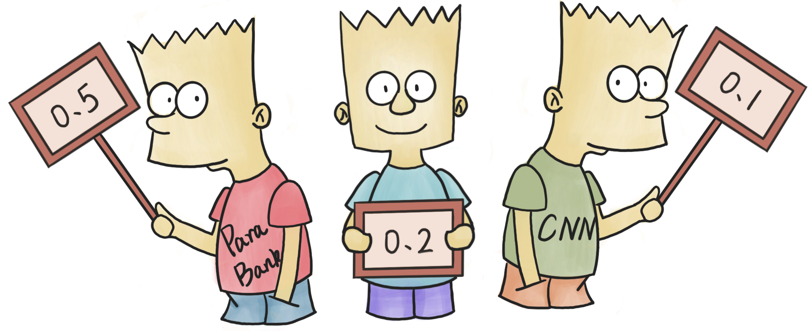
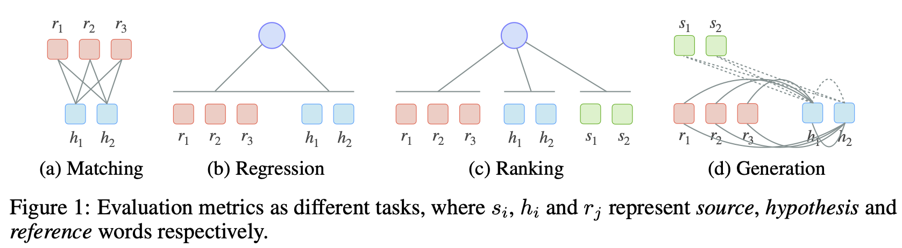

This is the Repo for the paper: [BARTScore: Evaluating Generated Text as Text Generation](https://arxiv.org/abs/2106.11520)

## Updates
- 2021.09.29 Paper gets accepted to NeurIPS 2021 :tada:
- 2021.08.18 Release code
- 2021.06.28 Release online evaluation [Demo](http://bartscore.sh/)
- 2021.06.25 Release online Explainable Leaderboard for [Meta-evaluation](http://explainaboard.nlpedia.ai/leaderboard/task-meval/index.php)
- 2021.06.22 Code will be released soon

## Background
There is a recent trend that leverages neural models for automated evaluation in different ways, as shown in Fig.1.


(a) **Evaluation as matching task.** Unsupervised matching metrics aim to measure the semantic equivalence between the reference and hypothesis by using a token-level matching functions in distributed representation space (e.g. BERT) or discrete string space (e.g. ROUGE).

(b) **Evaluation as regression task.** Regression-based metrics (e.g. BLEURT) introduce a parameterized regression layer, which would be learned in a supervised fashion to accurately predict human judgments.

(c) **Evaluation as ranking task.** Ranking-based metrics (e.g. COMET) aim to learn a scoring function that assigns a higher score to better hypotheses than to worse ones.

(d) **Evaluation as generation task.** In this work, we formulate evaluating generated text as a text generation task from pre-trained language models.

## Our Work
Basic requirements for all the libraries are in the `requirements.txt.`

### Direct use
Our trained BARTScore (on ParaBank2) can be downloaded [here](https://drive.google.com/file/d/1_7JfF7KOInb7ZrxKHIigTMR4ChVET01m/view?usp=sharing). Example usage is shown below.

```python
# To use the CNNDM version BARTScore
>>> from bart_score import BARTScorer
>>> bart_scorer = BARTScorer(device='cuda:0', checkpoint='facebook/bart-large-cnn')
>>> bart_scorer.score(['This is interesting.'], ['This is fun.'], batch_size=4) # generation scores from the first list of texts to the second list of texts.
[out]
[-2.510652780532837]

# To use our trained ParaBank version BARTScore
>>> from bart_score import BARTScorer
>>> bart_scorer = BARTScorer(device='cuda:0', checkpoint='facebook/bart-large-cnn')
>>> bart_scorer.load(path='bart.pth')
>>> bart_scorer.score(['This is interesting.'], ['This is fun.'], batch_size=4)
[out]
[-2.336203098297119]
```

We also provide multi-reference support. Please make sure you have the same number of references for each test sample. The usage is shown below.
```python
>>> from bart_score import BARTScorer
>>> bart_scorer = BARTScorer(device='cuda:0', checkpoint='facebook/bart-large-cnn')
>>> srcs = ["I'm super happy today.", "This is a good idea."]
>>> tgts = [["I feel good today.", "I feel sad today."], ["Not bad.", "Sounds like a good idea."]] # List[List of references for each test sample]
>>> bart_scorer.multi_ref_score(srcs, tgts, agg="max", batch_size=4) # agg means aggregation, can be mean or max
[out]
[-2.5008113384246826, -1.626236081123352]
```


### Reproduce
To reproduce the results for each task, please see the `README.md` in each folder: `D2T` (data-to-text), `SUM` (summarization), `WMT` (machine translation). Once you get the scored pickle file in the right path (in each dataset folder), you can use them to conduct analysis.

For analysis, we provide `SUMStat`, `D2TStat` and `WMTStat` in `analysis.py` that can conveniently run analysis. An example of using `SUMStat` is shown below. Detailed usage can refer to `analysis.ipynb`.

```python
>>> from analysis import SUMStat
>>> stat = SUMStat('SUM/REALSumm/final_p.pkl')
>>> stat.evaluate_summary('litepyramid_recall')

[out]
Human metric: litepyramid_recall
metric                                               spearman    kendalltau
-------------------------------------------------  ----------  ------------
rouge1_r                                            0.497526      0.407974
bart_score_cnn_hypo_ref_de_id est                   0.49539       0.392728
bart_score_cnn_hypo_ref_de_Videlicet                0.491011      0.388237
...
```

### Train your custom BARTScore
If you want to train your custom BARTScore with paired data, we provide the scripts and detailed instructions in the `train` folder. Once you got your trained model (for example, `my_bartscore` folder). You can use your custom BARTScore as shown below.

```python
>>> from bart_score import BARTScorer
>>> bart_scorer = BARTScorer(device='cuda:0', checkpoint='my_bartscore')
>>> bart_scorer.score(['This is interesting.'], ['This is fun.'])
```


### Notes on use
Since we are using the average log-likelihood for target tokens, the calculated scores will be smaller than 0 (the probability is between 0 and 1, so the log of it should be negative). The higher the log-likelihood, the higher the probability.

To give an example, if SummaryA gets a score of -1 while SummaryB gets a score of -100, this means that the model thinks SummaryA is better than summaryB.
## Bib
Please cite our work if you find it useful.
```
@inproceedings{NEURIPS2021_e4d2b6e6,
 author = {Yuan, Weizhe and Neubig, Graham and Liu, Pengfei},
 booktitle = {Advances in Neural Information Processing Systems},
 editor = {M. Ranzato and A. Beygelzimer and Y. Dauphin and P.S. Liang and J. Wortman Vaughan},
 pages = {27263--27277},
 publisher = {Curran Associates, Inc.},
 title = {BARTScore: Evaluating Generated Text as Text Generation},
 url = {https://proceedings.neurips.cc/paper/2021/file/e4d2b6e6fdeca3e60e0f1a62fee3d9dd-Paper.pdf},
 volume = {34},
 year = {2021}
}
```
